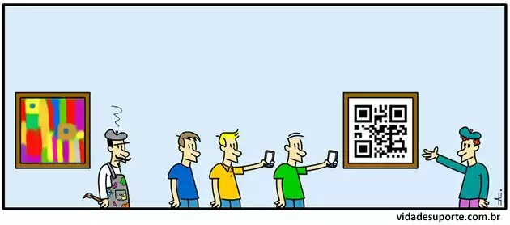
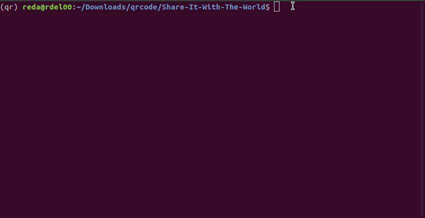

# SHARE IT WITH THE WORLD ~ QR CODE GENERATOR

<p align="center">
  
</p>

Have you ever wondered how QR codes work or how procedural images are generated? If you said yes to any of these questions, you're in luck!


## Setting up the Project

- Clone the repository using

```bash
git clone https://github.com/RdEl00/Share-It-With-The-World.git
```

- Open the terminal/cmd and navigate to the project folder.

```bash
cd Share-It-With-The-World
```

- For this project, you will need Python3 and Pillow, tqdm, qrcode libraries
    - The `qrcode` library: perform all of our QR code related operations.
    - The `pillow` library: help us process and save images.
    - The `tqdm` library:  make our loops show a smart progress meter

```bash
pip3 install -r requirments.txt
```

## QR code Overview

Input: `I am just a child who has never grown up. I still keep asking these (how) and (why) questions. Occasionally, I find an answer. - Stephen Hawking`

Output: `qrcode.png`

<p align="center">
  
</p>

## Usage

- Now run the the script using

```bash
python3 qr_script.py
```
<p align="center">
  
</p>

    
Congrats! You just created your own Qr code 🤩 - Go share it with the world! 🚀